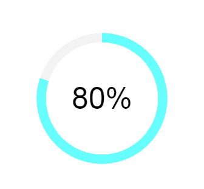

造轮子和demo测试
--------------------------------------------------------------------
## Progress.js canvas进度条插件说明

### Getting Start
1. 引入progress.js文件，支持AMD/CMD和全局变量引入
> import Progress from 'path/to/progress.js'

> require("path/to/progress.js")

> \

2. 使用Progress初始化
> var progress = new Progress($(\'#progress\'), 87); 

> progress.init();
3. 绘制动画效果
> progress.draw();
### API & Params
#### Constructor
- Node ：  native dom节点
> 如：document.querySelectorAll(\'#canvans-container\')
>> html结构如下： 
\
 \<canvas> \</canvas> \

- progress ： 绘制进度
> 如：87
- options： 配置参数
> bgColor: 背景底色，如：#fff

> drawColor: 绘制进度条颜色，如：#542

> textColor: 文本颜色，如：#000

> lineWidth: 进度条宽度，如：15

> radius: 圆环半径，如：100

> fontSize: 文本字体大小，如：30
#### methods
- init()
> 初始化进度条背景及文字
- draw()
> 动态绘制进度条
- clear()
> 清空画板，包括文本内容
- rePaint()
> 重新绘制进度条，修改进度条值，动态绘制可使用

### 支持拖拽缩放的canvas绘制矩形
#### Use
`new TraistionCanvas(size, position, container)`

demo: [https://hquestion.github.io/static/resize-canvas-rect/test.html](https://hquestion.github.io/static/resize-canvas-rect/test.html)